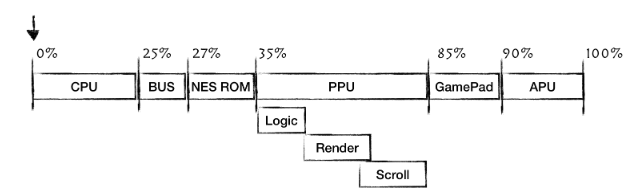

# Research
Rust book for esp32: https://docs.esp-rs.org/book/overview/using-the-standard-library.html
Intro to writing a NES emulator in Rust: https://bugzmanov.github.io/nes_ebook/index.html

Note: NES has no operating system, so the application/high-level programming layer interacts directly with machine code instead of using an OS and assembler. 

## Primary Components
- CPU: NES A203 is simply a modified 8-bit 6502 
- Picture Processing Unit (PPU): 2C02 bby Ricoh (same company as CPU) chip to draw current state of the game
    - Both CPU and PPU have access to respective 2 KiB (2048 bytes) banks of RAM
- Audio Processing Unit (APU): Part of 2A03 chip and generates specific five-channel based sounds
- CartridgesL: Where most of the magic happens. Usually has at least two large ROM chips: the Character ROM and the Program ROM. Character ROM is hooked up directly to the PPu and stores graphics data while the Program ROM is connected directly to the CPU and contains CPU instructions for the game. Later versions of cartridges had additional hardware accessible through mappers to improve gameplay and visuals. 
- Gamepads: 8 button gamepad for 8 bits
    - Technically, the CPU , PPU and APU are independent of each other, making a distributed system. 

## NES Components Schema 

# Open Questions
What really is required for emulation of NES?

## CPU Emulation
The only two resources that the CPU has access to are the Memory Map and CPU Registers.

From a programming standpoint, the memory map is just a continuous array of 1-byte cells. NES CPU uses 16-bit for memory addressing, which means that it can address 65536 different memory cells. The NES platform had only 2 KiB of RAM connected to the CPU

